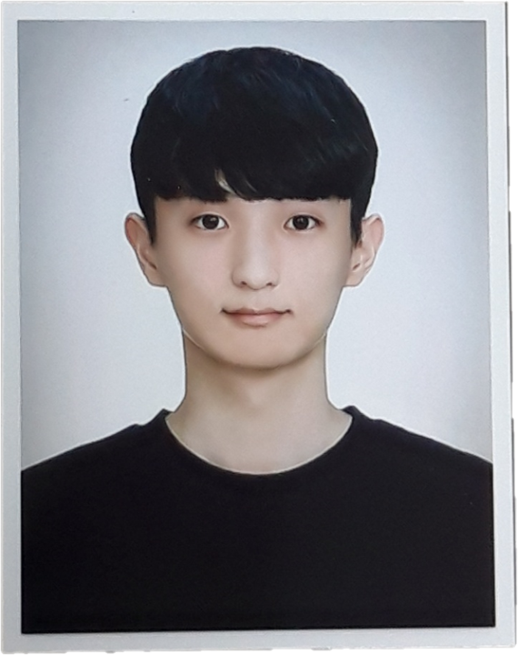
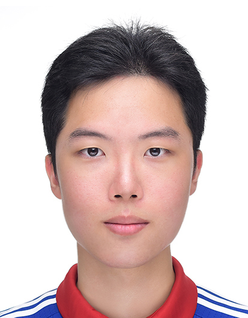

# Hello, We are Team P.R.I.S.M! 👋

우리는 현실 세계의 물리 법칙을 디지털 공간에 완벽하게 구현하고자 모인 **Team P.R.I.S.M**입니다.  
건국대학교 드림학기제(2026/1학기)를 통해 **AI 기반 고성능 실시간 물리 시뮬레이션 소프트웨어**를 연구하고 개발합니다.

---

## 👥 Meet Our Team

|  |  |  |
| :---: | :---: | :---: |
| **LSM (이수민)** | **JGN (정근녕)** | **HSH (한승현)** |
| **Engine Architect & Rendering** | **Engine Architect & Rendering** | **Physics & AI Specialist** |
| *Core Architecture & Ray Tracing* | *Core Architecture & Ray Tracing* | *Softbody & Physics AI Model* |
| 상용 엔진 아키텍처 분석 및 하이브리드 렌더링 파이프라인 설계 | 신규 엔진 아키텍처 설계 및 광선 추적 알고리즘 연구 개발 | 물리 시뮬레이션 로직 구현 및 Physics AI 모델 설계/학습 |

---

## 🌈 Project: P.R.I.S.M

**Physics Ray-tracing Interactive Softbody-simulation Module**

단순한 그래픽을 넘어, GPU 주도형 광선 추적과 AI 가속 물리 시뮬레이션을 결합하여 실시간으로 상호작용 가능한 '살아있는' 물리 환경을 구축합니다.

- **P**hysics: 뉴턴 역학 및 FEM 기반의 정교한 연속체 물리 시스템
- **R**ay-tracing: GPU-Driven 하이브리드 렌더링을 통한 실사 시각화
- **I**nteractive: 실시간 조작 및 즉각적인 물리 피드백 보장
- **S**oftbody: 머리카락, 옷감, 젤리 등 유연한 물체의 고난도 시뮬레이션
- **M**odule: 고효율 연산을 위한 인공지능(Physics AI) 도입 및 모듈화

---

## 🛠 Tech Stack & Focus
- **Language**: Modern C++ (C++17/20), Python (for AI Training)
- **Graphics Engine**: [OgreNext](https://github.com/OGRE-Next/ogre-next) (Core Architecture Analysis & Customization)
- **Graphics API**: Vulkan 1.3, HLMS, GLSL (SPIR-V)
- **Physics & AI**: Finite Element Method (FEM), Physics-Informed Neural Networks (PINNs)
- **Key Tech**: GPU-Driven Rendering, Hybrid Path Tracing, Disney BSDF, Physics AI Optimization

---

## 📈 Roadmap & Progress
- [x] OgreNext 2.3+ 코어 아키텍처 분석 및 환경 자동화
- [x] CPU-GPU 데이터 전송 병목 제거를 위한 시스템 설계
- [x] Disney BSDF 기반 PBR 및 프레임 누적 노이즈 제거 구현
- [ ] 다양한 물리 시뮬레이션 알고리즘(Mass-Spring, FEM) 비교 환경 구축
- [ ] FEM 고비용 연산 해결을 위한 **Physics AI** 기술 도입
- [ ] 기술 보고서(아키텍처 설계도, 성능 분석) 및 최종 데모 제작

---

### 📫 Let's Connect!
우리의 연구 과정이나 기술 스택에 대해 더 궁금한 점이 있다면 메인 저장소를 방문해 주세요.

[👉 P.R.I.S.M 메인 저장소 바로가기](https://github.com/your-username/PRISM)
